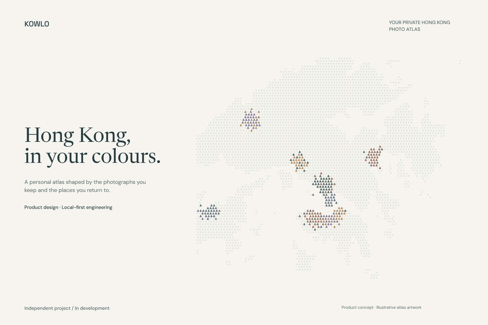

# KOWLO

**Hong Kong, in your colours.**

A private photo atlas of Hong Kong, shaped by the photographs you keep and the places you return to. Folded marks give the city its form; colours from your photographs make it yours.



**Independent project · In development**

Product design, geographic data and local-first engineering. Explore the proposed experience and the working foundations behind it.

[Explore the case study](docs/PORTFOLIO.md) · [View in Figma](https://www.figma.com/design/whw3t850Pcj9LrSiBa8rwn/Hong-Kong-Footprints?node-id=166-147) · [Brand direction](docs/KOWLO_IDENTITY.md)

## The experience

Start with the whole city. Move into a district chapter, then return to the places and photographs that give it meaning. Repeat visits deepen a chapter; they do not inflate the number of districts visited. Original location evidence stays separate from suggested place names and personal labels.

## Design backed by working foundations

| Product idea | Existing implementation and evidence | Remaining boundary |
| --- | --- | --- |
| A personal memory print | [Working atlas preview](docs/evidence/atlas-preview.md) using deterministic cells from saved GPS and optional palettes | Final design approval and production delivery |
| Districts become chapters | [Grouping, distinct district counts and colour recalculation after deletion](docs/evidence/district-chapters.md) | Final product flow and device verification |
| Memories remain under your control | [Working atlas offline behaviour](docs/evidence/atlas-offline.md), [export](docs/evidence/journal-geojson-export.md), [explicit deletion](docs/evidence/deletion-confirmation.md) | Production installation and account experience |
| Private sync handles uncertainty | [Identity checks, revision conflicts and interrupted requests](docs/evidence/authenticated-sync-transport.md) | Live hosted authentication and end-to-end sync |

These links record checks performed at specific development stages. They are evidence of those scoped behaviours, not a claim that the complete product has shipped.

## Explore locally

```sh
npm ci
npm test
npm run diagnostic
```

Open the [working KOWLO atlas](http://127.0.0.1:8787/app/index.html) to explore saved locations, district chapters, notes and local export. It reads the journal saved on this same browser and origin; an empty journal correctly shows an uncoloured map. Automatic phone photo-library connection is still in development. [Preview verification and screenshots](docs/evidence/atlas-preview.md) describe the tested scope.

After the atlas displays **Ready offline**, it can reopen saved chapters, edit notes, export JSON and confirm local deletion without the server, in that same browser and origin. [Offline verification](docs/evidence/atlas-offline.md) records preparation failure, update handling and the static cache boundary.

The atlas now includes installation metadata and KOWLO icons. [Local Chromium installation verification](docs/evidence/atlas-installation.md) records an actual standalone app launch and a fresh offline relaunch with saved district colours. Production hosting and phone installation remain unverified; installation does not grant automatic photo-library access.

The [photo-import diagnostic](http://127.0.0.1:8787/experiments/photo-import/index.html) remains available for technical feasibility checks, including **Run 10 synthetic fixture checks**. The Figma presentation remains the proposed design source.

## Project context

[Research](docs/RESEARCH.md) · [Architecture](docs/ARCHITECTURE_AND_DESIGN.md) · [Approved project brief](docs/FULL_PROJECT_PROMPT.md) · [Photo-library scope](docs/AUTOMATIC_LIBRARY_AMENDMENT.md)

This public portfolio brings together the design process and implementation evidence. The complete application, automatic photo-library flow and hosted sync are still in development. The screenshots use illustrative content; private journal records are not part of the portfolio.

[Visual and data credits](ATTRIBUTION.md) · [Product milestones](docs/PORTFOLIO.md#public-portfolio-and-product-milestones)

<details>
<summary>Technical development log and historical verification evidence</summary>

These records preserve earlier development stages, names and repository visibility. KOWLO is the current identity; references to Placefold, Kongloom or a private repository below describe earlier work.

The artistic atlas now has a tested data foundation: saved GPS observations form deterministic memory-print cells, retain original coordinates, and derive accents only from optional saved photo palettes. [Memory-print evidence](docs/evidence/memory-print-pipeline.md) records 46 passing Node checks and a real Chromium extraction/storage/deletion driver. This module is not yet wired to the production interface. [The current Figma direction](docs/ATLAS_DESIGN_REVISION.md) remains available for approval.

Saved observations now form district chapters using their actual opted-in photo palettes. Returns enrich one chapter; deletion recalculates its colours and district count. [District chapter evidence](docs/evidence/district-chapters.md) records 42 passing Node checks and desktop/mobile/offline Chromium verification. The latest diagnostic shell is v12 with 19 static assets, including the memory-print data module verified through a server-off reload and deletion. Older evidence below records the versions tested at the time.

Local deletion now requires confirmation for locations, notes and the whole collection. Cancelling preserves records and prepared downloads; confirmed deletion is verified through offline reload. See [deletion confirmation evidence](docs/evidence/deletion-confirmation.md).

**Status: approved project Goal active; Figma concepts and local feasibility implementation available for review. The production application is not complete.**

Working project name only; Placefold is a proposed brand. The new Figma file exists. [The private GitHub repository](https://github.com/EricEremos/hong-kong-footprints) now contains the local foundation, research, Figma exports and verification evidence on `main`. The initial push was verified against GitHub's commit API; see [repository evidence](docs/evidence/private-repository-baseline.md). The Supabase cloud project has not been created.

1. [Complete proposed project prompt](docs/FULL_PROJECT_PROMPT.md) — the document to approve or correct before work starts.
2. [Research and evidence](docs/RESEARCH.md) — reference analysis, academic foundations, technical feasibility, geographic data, and limitations.
3. [Architecture and design proposal](docs/ARCHITECTURE_AND_DESIGN.md) — proposed system, user experience, delivery sequence, and verification matrix.

Research date: 5 September 2026. Findings distinguish source claims, direct observations, and proposed engineering decisions. This is a literature-informed feasibility study, not a systematic review or a tested application.

The original prompt was approved and the Goal activated. The later automatic photo-library experience is documented in [the platform amendment](docs/AUTOMATIC_LIBRARY_AMENDMENT.md); native phone delivery remains a pending scope decision. The latest editable Figma concepts and their limitations are recorded in [the automatic atlas review](docs/evidence/automatic-atlas-review.md).

The local research diagnostic extracts photo metadata and assigns source-backed districts without uploading images. It is a feasibility tool, not the product's proposed automatic library flow. [Runtime evidence](docs/evidence/local-district-runtime.md) records 19 passing tests, 684 independent geographic comparisons, and the observed browser result.

Run `npm test` for metadata and district checks. Run `npm run diagnostic`, open `http://127.0.0.1:8787/experiments/photo-import/index.html`, and use **Run 10 synthetic fixture checks** for the browser check. Fixture regeneration uses `npm run fixtures`; the independent geographic oracle uses `.venv_py312/bin/python scripts/generate-district-fixtures.py` with Shapely installed in that local research environment.

The initial [private journal migration](supabase/migrations/202609060001_private_journal.sql) stores owner-scoped locations and separately authored notes. Run `python3 scripts/test-private-journal.py` with PostgreSQL 17 tools on PATH to exercise 58 database checks in an isolated, socket-only test cluster. The script stops the cluster on exit and retains its files under `/tmp/placefold-db-*` for inspection. [Database evidence](docs/evidence/private-journal-storage.md) distinguishes tested database policies from pending hosted API and PostGIS verification.

The [sync migration](supabase/migrations/202609060003_private_sync.sql) replaces direct client writes with revision-checked operations, retry receipts, retained deletion markers and a bounded metadata feed. It also retires unresolved, locally purged uploads so delayed requests cannot execute afterward. `python3 scripts/test-private-journal.py --sync` passed 132 checks on PostgreSQL 17.10. [Retirement evidence](docs/evidence/lost-response-retirement.md) and the [integration contract](docs/SYNC_PROTOCOL.md) describe the verified local boundary and remaining hosted deployment and production integration work. This command tests migrations 001 and 003; it does not verify the PostGIS migration or cloud synchronization.

The [authenticated transport adapter](src/journal/sync-journal.mjs) checks the signed-in identity before transferring allowlisted metadata, resumes frozen requests, reconciles deleted uploads and preserves conflicts for an explicit decision. [Transport evidence](docs/evidence/authenticated-sync-transport.md) records 13 scenarios using real Chromium fetch and IndexedDB against intercepted synthetic endpoints, plus 27 passing Node checks. With the diagnostic server running, execute `node scripts/sync-transport-checks.mjs` with Playwright available (or set `PLAYWRIGHT_MODULE` to its installed module path). Live Supabase authentication, the complete hosted migration chain, sign-in UI and production sync wiring remain unfinished.

The second [spatial migration](supabase/migrations/202609060002_observation_geometry.sql) derives WGS84 geometry and supports private viewport queries. The 001 → 002 → 003 chain passed **163 checks on PostgreSQL 18.4 / PostGIS 3.6.4** in an isolated runtime. [Spatial evidence](docs/evidence/spatial-migration-readiness.md) records package provenance and remaining hosted verification.

Migrations 004 and 005 add the pinned official district reference, boundary-aware classification and private observation classification. The full 001–005 chain passed **209 database checks**, and real Chromium matched PostGIS on **684 geographic controls**. Run `python3 scripts/test-private-journal.py --postgis --sync --districts` with the spatial runtime on PATH. [District evidence](docs/evidence/district-browser-postgis-parity.md) records exact results and truthful milestone rules. This is local evidence; production integration and hosted Supabase JWT/PostgREST verification remain unfinished.

The [place-name source evaluation](docs/evidence/place-name-source-evaluation.md) adds pinned Lands Department reference responses: 2,706 geographic points and 2,826 official/alias name rows. All geographic IDs join correctly. Category and spatial checks expose island, harbour and district-label differences that prevent treating a nearest name as a confirmed visit. The [verified catalog loader](docs/evidence/place-catalog-loader.md) checks both source hashes and exposes immutable places with official names, aliases and provenance; all entries match between Node and Chromium. The [nearby-place diagnostic](docs/evidence/nearby-place-suggestions.md) now shows up to three unconfirmed Settlement/Island suggestions within an exploratory 1 km radius, with source pins and distances. Missing references preserve GPS, suggestions never award milestones, and offline import was verified with the server stopped. Production locality selection and persistence remain unfinished.

The [local journal store](src/journal/local-journal.mjs) saves metadata and notes in IndexedDB, with separate device/account scopes, export and deletion. Version 3 adds stored server revisions and a frozen account outbox; incoming pages merge atomically with their cursor while retaining competing edits and purging deleted payloads. Explicit local/remote choices reject stale decisions and prevent reuse of deleted IDs. Retirement results can safely release a purged request while preserving its queued deletion and newer remote changes. With the diagnostic server running, open `http://127.0.0.1:8787/experiments/offline-journal/index.html`, run the checks, then use the reload button. [Current browser evidence](docs/evidence/lost-response-retirement.md) records 57 passing checks, including concurrent choices and full reload. Authentication, cloud transfer and production conflict UI remain unfinished.

The photo-import diagnostic now connects accepted worker results to that store. After running fixtures, use **Save accepted locations locally**, reload, then export or delete the saved locations. Save is explicit and each staged batch can be saved once; repeated imports remain separate observations but never inflate distinct district milestones. [Integration evidence](docs/evidence/photo-journal-integration.md) records real browser import, reload, downloaded JSON, GPS-only mode and deletion checks. This remains a technical diagnostic rather than the proposed automatic-library product interface.

Saved locations now regain nearby-name context from verified references and support editable notes and personal place labels. Labels remain separate from original GPS and earned district progress. Deleting a location retains its notes in an editable section; export includes the authored records but never treats a suggested name as a verified visit. [Journal locality evidence](docs/evidence/journal-locality-integration.md) records real Chromium create/edit/cancel/retry/reload, reference failure, district deduplication, note retention and offline checks. That v10 verification used 18 static assets. Production map, automatic library flow and final reward design remain unfinished.

**Export local journal** now prepares JSON and GeoJSON downloads from the same saved snapshot. The map file preserves original GPS, optional colours, capture-time uncertainty and user-authored notes/labels. Retained notes have null geometry. [GeoJSON evidence](docs/evidence/journal-geojson-export.md) records actual online/offline file downloads, 200 generated snapshot cases, distinct mobile touch targets and the boundaries of this export contract.

Enable **Derive photo colours locally** to extract and optionally save up to three decorative accents. GPS survives unavailable image decoding. [Palette evidence](docs/evidence/local-photo-palettes.md) records 23 current Node tests, 18 IndexedDB checks, browser opt-in/opt-out, exact reload persistence and deletion. Colour extraction is an initial histogram heuristic; complex-photo aesthetic quality and native phone thumbnails remain unverified.

The photo-import diagnostic now has an [offline shell](docs/evidence/offline-shell.md). After its first successful online load displays **Offline shell ready**, it can reopen saved records without the local server. Reopening, export generation and deletion were verified with the server stopped. The cache contains only an explicit list of application resources and reference geography, not photos or journal data. Synthetic fixture downloads still require the server. The [v7 verification](docs/evidence/nearby-place-suggestions.md) adds offline photo import and nearby references; the current Node suite passes 41 checks. This is infrastructure for the approved offline draft requirement; production installation, approved UI and device verification remain incomplete.

</details>
