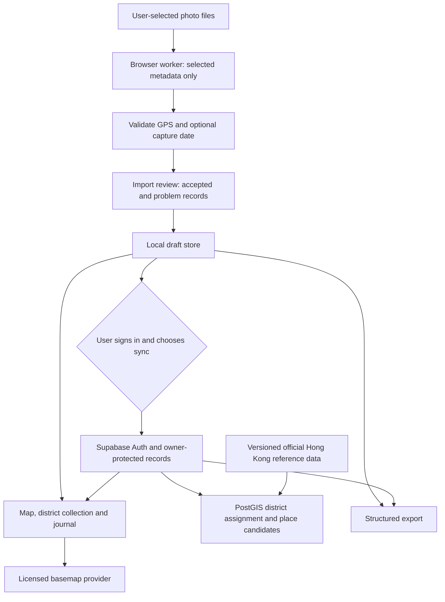

# Architecture and design proposal

**Current revision:** [Automatic-library amendment](AUTOMATIC_LIBRARY_AMENDMENT.md) records the user's replacement of manual photo selection with permission-based scanning. The browser-only import diagram below describes the previous proposal and a possible secondary web fallback. Native mobile delivery awaits the platform decision.

**Proposal only.** Scope and authority are governed by the [complete project prompt](FULL_PROJECT_PROMPT.md). Source support and limitations are recorded in [the research report](RESEARCH.md).

## 1. System shape

Image bytes remain local. Optional previews are temporary local UI material and are not part of cross-device synchronization. Consequently this is a location journal derived from photos; it is not a cloud photo album. The user should understand that before importing.

Keep parsing off the main thread, bound batch memory and file-size handling, and support cancellation. Persist incremental draft outcomes so a late file failure does not invalidate the whole batch. Do not promise a batch size or elapsed-time target until representative devices are benchmarked.

For local-only mode, assign districts with the same validated reference geometry and boundary semantics used by the server. Keep dataset versions visible in records so synchronization can detect an assignment change. Do not require a backend request merely to inspect locally extracted coordinates.

## 2. Proposed data model

| Entity | Minimal responsibilities |
|---|---|
| `observations` | Owner, generated ID, GPS geometry in verified SRID 4326, optional raw capture time/offset and interpreted-time basis, import timestamp, source kind, dataset version, assignment status |
| `import_batches` | Owner, import state and outcome counts; no original photo blobs |
| `journal_entries` | Owner, linked observation or place, optional note, revision information |
| `districts` | Official ID, bilingual names, validated geometry, dataset provenance and digest |
| `place_names` | Authoritative name, type, point, source and version; no invented neighborhood polygon |
| Browser draft/outbox | Pending changes and retry state scoped to the signed-in user or clearly separate local-only session |

Exact-file duplicate detection can use a private local digest. If a digest is later synchronized, treat it as sensitive per-owner metadata. Do not create cross-user photo fingerprints. Identical coordinates are not sufficient proof that two distinct photographs are duplicates.

Preserve the original observation when a user corrects its place label. Store user correction separately from calculated assignment. A date without an offset is not necessarily a UTC timestamp; preserve the raw value and label any inference.

Use explicit per-operation RLS and grants: read/delete ownership checks, insert owner checks, and both existing-row and new-row checks for updates. Audit exposed functions/views. Do not put a service-role secret in the client. Verification must make direct requests as two different accounts, including malicious owner reassignment attempts.

Export should contain versioned structured records and useful GeoJSON coordinates with attribution/provenance where relevant. Define deletion across UI state, local cache, synchronized records and retry queues. Document provider backup retention instead of promising immediate erasure from every backup.

## 3. Geographic assignment and uncertainty

1. Reject nonfinite values, invalid latitude/longitude ranges and incomplete GPS pairs.
2. Preserve longitude/latitude order explicitly at format boundaries. Test one known landmark through every conversion.
3. Validate reference geometry and its district identifiers before import. Retain the source digest.
4. Use boundary-inclusive containment semantics, preserving zero-match and multiple-match results.
5. Display out-of-scope, offshore and ambiguous points honestly. Do not invent a GPS accuracy radius when the source supplies none.
6. Suggest named localities using the source's place types and benchmarked proximity rules. A nearest name is a suggestion, not a containment result.
7. Record the dataset version and method behind an assignment. Preserve user corrections across future dataset refreshes.

Defer H3 grids, map matching, route reconstruction and machine-learning place inference. None is required to deliver the core record correctly.

## 4. Design brief for Figma

**Product feeling:** a carefully kept atlas of personal places. The geography carries the visual character; decoration stays quiet.

**Proposed visual foundations:** warm paper background, near-black text, deep harbor green for primary actions, a restrained clay accent for selected highlights. Exact color values will be chosen and contrast-checked in Figma. Use readable body type around 16 px, a clear title hierarchy and internal 44 px touch-target guidance. This internal target is more generous than the WCAG 2.2 AA minimum-size rule; do not present it as the exact AA requirement. [WCAG 2.2 reference](https://www.w3.org/WAI/WCAG22/quickref/).

**Geographic artwork:** use sourced administrative outlines for district records, labelled as district boundaries. The official district dataset includes marine areas and is not a coastline. A future land silhouette needs a separately verified source. Record dots and decorative marks need clearly different meanings. Never use decorative fill as evidence of a traveled area.

**Initial frames:** approximately 390 px mobile and 1440 px desktop, followed by intermediate-width checks. Sizes are design starting points, not rigid runtime dimensions.

| Surface | Main purpose | Essential state coverage |
|---|---|---|
| Welcome/import | Explain metadata handling and select files | GPS-only, optional capture dates, explicit sync choice |
| Import review | Show what was actually recovered | Progress/cancel, partial success, missing GPS, invalid/unsupported, duplicates |
| Map | Explore personal observations | Clusters, selected record, ambiguous/offshore, failed map with list fallback |
| Journal | Remember places and write notes | Dated and undated entries, no records, edit/save failure |
| District collection | Understand distribution across 18 districts | Unrecorded districts, verified counts, provenance |
| District detail | Read locality records within an area | No data, ambiguous assignments, corrected labels |
| Data/settings | Control privacy and portability | Offline pending changes, session expired, export, delete, quota failure |

Mobile uses three primary destinations with a visible Import action. Desktop pairs persistent navigation with map and journal detail. Avoid making pinch/drag gestures the only way to reach a record. Support focus order, screen-reader labels, keyboard controls, text alternatives and reduced motion.

The first prototype should test whether users understand three things: which metadata is extracted, what a district count means, and when their records leave the device. Aesthetic preference alone cannot validate these flows. Recruit representative Hong Kong users for label comprehension and navigation when available; report actual participant coverage.

## 5. Post-approval work units and gates

| Work unit | Concrete output | Gate to proceed |
|---|---|---|
| Feasibility | Minimal import diagnostic, fixture results, geometry report | Real picker evidence supports a useful supported path; no silent GPS fabrication |
| Figma | Editable tokens/components, responsive frames, primary-flow prototype | User reviews actual designs before final UI production |
| Private setup | Verified private GitHub target and Supabase project configuration | Exact account/organization/region and no-purchase scope resolved |
| Vertical slice | Import → review → district record → private save | Network inspection and owner isolation pass |
| Complete beta flows | Map, journal, district collection, offline drafts, sync, export/delete | End-to-end scenarios pass against real state |
| Beta handoff | Setup documentation and evidence report | Agreed browser/device, spatial, access-control and visual acceptance satisfied |

If native photo-library access proves indispensable, bring the evidence back as a scope decision before replacing the requested PWA approach. If Figma or a cloud connection is unavailable, continue independent authorized feasibility work without claiming the blocked surface has been delivered.

## 6. Verification matrix

| Area | Minimum scenario | Evidence to retain |
|---|---|---|
| Photo metadata | Known JPEG/HEIC; missing GPS; malformed input; duplicate; canceled batch | Expected versus extracted values, parser version, fixture provenance |
| Real selection | iPhone Photos/Files and installed/browser paths; Android and desktop paths agreed for beta | Exact device/OS/browser/version, picker path, outcome; unavailable paths labeled |
| Geography | Representative point in each district; shared edge; holes/islands; coast; outside HK | Fixture coordinates, expected outcomes, dataset digest and validation report |
| Privacy | Extract, review and sync a test batch | Network evidence that no original image bytes or unnecessary metadata leave the browser |
| Authorization | Account A attempts operations on B; owner reassignment; anonymous access | Direct API outcomes and policy/migration revision |
| Offline/sync | Disconnect, reload, reconnect, expire session, switch accounts | Observed draft recovery, conflict behavior and cache isolation |
| Portability/deletion | Export/reconcile; delete pending and synced records | Parse/reconciliation counts and local/backend deletion observations |
| Installation | Phone and desktop installation on available supported platforms | Real launch/install outcome and documented platform instructions |
| UI/accessibility | Approved mobile/desktop flows; keyboard and list-only access | Screenshots, flow outcomes, contrast/focus checks and remaining issues |

Do not substitute fixture success for picker compatibility, a policy definition for access-control tests, or green builds for visual verification. Verify once after relevant inputs change and broaden testing only when a failure or new risk justifies it.

## 7. Current evidence boundary

The full prompt and native Goal are approved. A local photo-metadata feasibility implementation has passed 14 Node tests with synthetic fixtures; real phone picker compatibility remains unverified. Figma now contains an editable brand direction, 25 variables, nine text styles, button variants, a place-record component, three mobile screens and a desktop journal. Five prototype navigation connections are recorded. See [design review evidence](evidence/figma-review.md) for actual render and interaction results. The name Placefold and these first screens await user review. This is not yet an installed PWA or demonstrated cross-device sync; backend, production UI and full beta verification remain outstanding.
