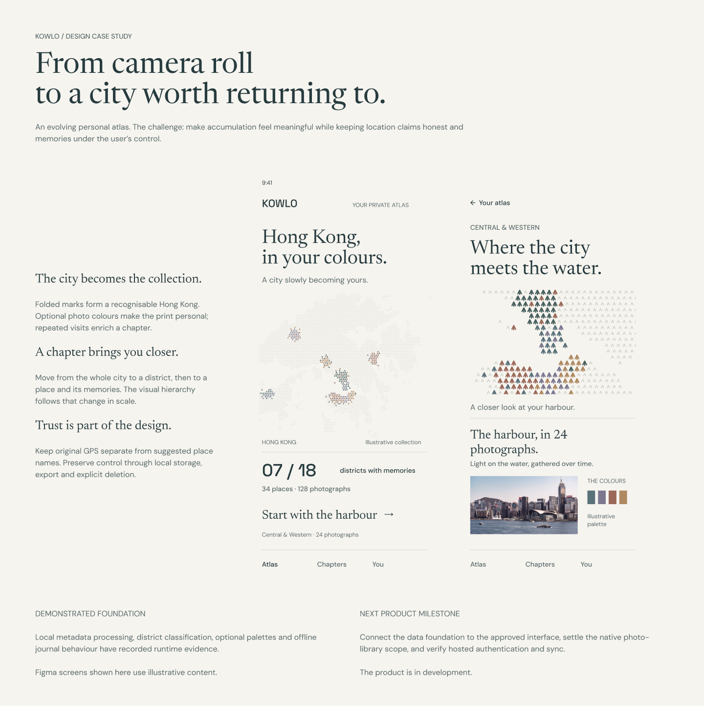

# KOWLO: Hong Kong, in your colours

**Independent project · 6 September 2026 · Product in development**

KOWLO explores how a photo collection can become a personal atlas. It combines an editorial journal with a Hong Kong silhouette made from folded marks. Its name is inspired by Kowloon, while the colour association expresses a personal promise: each person's Hong Kong takes on its own colours. The central design question is simple: how can a growing map feel personal while remaining honest about what its location evidence proves?

[Editable cover in Figma](https://www.figma.com/design/whw3t850Pcj9LrSiBa8rwn/Hong-Kong-Footprints?node-id=166-147) · [Editable case-study board](https://www.figma.com/design/whw3t850Pcj9LrSiBa8rwn/Hong-Kong-Footprints?node-id=166-242)

## The product idea

The proposed experience starts with the photographs a person already keeps. They see Hong Kong as an accumulating atlas, explore a district chapter, and revisit individual places and memories. Colour gives that progression an emotional character; geography gives it structure.

The automatic photo-library experience is an intended product direction. The current browser diagnostic uses explicit imports, and native phone delivery remains a scope decision. See the [platform amendment](AUTOMATIC_LIBRARY_AMENDMENT.md).

## Three connected design decisions

**Make the city the collection.** The atlas uses many folded marks instead of making a list of thumbnails the primary view. Optional colours derived from saved photographs enrich the print. The current data module groups observations into deterministic cells while preserving original coordinates, so the decorative representation does not replace the geographic record.

**Let scale reveal the story.** The proposed journey moves from city to district to place. Repeat visits enrich a chapter while district progress remains a count of distinct supported districts. This lets the collection grow without turning repeated imports into artificial achievement.

**Make trust visible in behaviour.** Suggested place names, user-authored labels and original GPS are separate concepts. Local storage, export and confirmed deletion provide practical control. Sync work explicitly handles competing edits and interrupted requests instead of assuming every transfer succeeds.

The screens contain illustrative photographs, colours and collection totals. They demonstrate the proposed hierarchy, not a real person's travel history or measured product usage.

## Visual system

The presentation extends the existing [memory-print direction](ATLAS_DESIGN_REVISION.md) with the current [KOWLO identity](KOWLO_IDENTITY.md). Newsreader carries the editorial voice; DM Sans supports reading and interface labels; Space Grotesk anchors the wordmark and numbers. Paper, deep green ink and muted photo-derived accents keep the map and memories at the centre.

The cover and case-study board use existing Figma text styles and colour variables. The atlas artwork is an instance of the existing vector component. The mobile views remain editable clones of the current concept screens. These are reusable design compositions, not flattened screenshots inside Figma.

## What the project can demonstrate today

| Capability | Evidence to inspect | What it does not yet establish |
| --- | --- | --- |
| Memory-print data | [Pipeline evidence](evidence/memory-print-pipeline.md): deterministic cells, palette opt-in, preserved GPS and deletion behaviour | The final interface running on this module |
| Meaningful district progress | [District chapters](evidence/district-chapters.md): distinct district grouping and recalculation | User research validating the final reward experience |
| Geographic consistency | [Browser/PostGIS parity](evidence/district-browser-postgis-parity.md): comparisons against geographic controls | That a nearby suggested locality is a confirmed visit |
| User control | [GeoJSON export](evidence/journal-geojson-export.md), [offline shell](evidence/offline-shell.md) and [deletion confirmation](evidence/deletion-confirmation.md) | Complete production installation and device coverage |
| Resilient private sync | [Transport evidence](evidence/authenticated-sync-transport.md): real browser fetch/IndexedDB with intercepted synthetic endpoints | Live Supabase authentication, hosted API behaviour or production sync |

The linked records are historical, scoped verification. No new application test results or usage outcomes are claimed by this presentation. There are no supported retention, adoption or usability metrics to publish yet.

## Public portfolio and product milestones

This repository is published as a portfolio of an evolving product. Public source and design documentation do not make personal journal data public. KOWLO is the selected naming direction, replacing the earlier Placefold and Kongloom studies.

1. **Make one complete product journey work.** Connect the approved atlas interface to local data, demonstrate district-to-place navigation and exercise export and deletion on representative devices. Resolve native library scope before presenting automatic access as delivered.
2. **Show the reasoning and the proof.** Record a short walkthrough using synthetic or deliberately approved content. Pair each significant design claim with the implementation or observed user evidence that supports it. Present unresolved work plainly.
3. **Keep the portfolio current.** Let the README introduce the experience, and keep detailed verification in linked evidence records. Add real product demonstrations as complete journeys become available. [Credits and reuse terms](../ATTRIBUTION.md) identify third-party assets and data. A repository-wide software license has not been selected.

## Presentation record

- Figma cover: `166:147`, 1440 × 960.
- Figma case-study board: `166:242`, 1440 × approximately 1444.
- Existing artwork source component: `114:63`; mobile concept sources: `116:112` and `116:113`.
- Local exports: `design-assets/portfolio-cover.png` and `design-assets/portfolio-case-study.png`.
- The new presentation preserves the existing design identity and concept content. Source provenance and limitations remain recorded in [the design revision](ATLAS_DESIGN_REVISION.md).
- The public portfolio publishes the design and current local foundation. It does not deploy the application or establish hosted-service readiness.

## Initial presentation verification

Verified on 6 September 2026:

- Both Figma boards were rendered and visually inspected. The cover has no overflowing children; the case-study board's harbour close-up intentionally extends inside a clipped frame.
- All newly created presentation text uses the existing text styles and bound colour variables. The cloned mobile screens preserve their existing local overrides. The artwork remains component instances and the board structure uses Auto Layout.
- All relative Markdown links in this README/case-study pair resolve to local files.
- A local Markdown preview was opened in the in-app browser. The cover loaded, the README's technical-history disclosure expanded, and the case-study link opened the intended page. This was an approximate Markdown preview, not verification of GitHub's renderer. Chrome control was unavailable in this session.
- Application code was outside this presentation pass, so historical application test counts were retained with their original scope rather than rerun or presented as new results.
