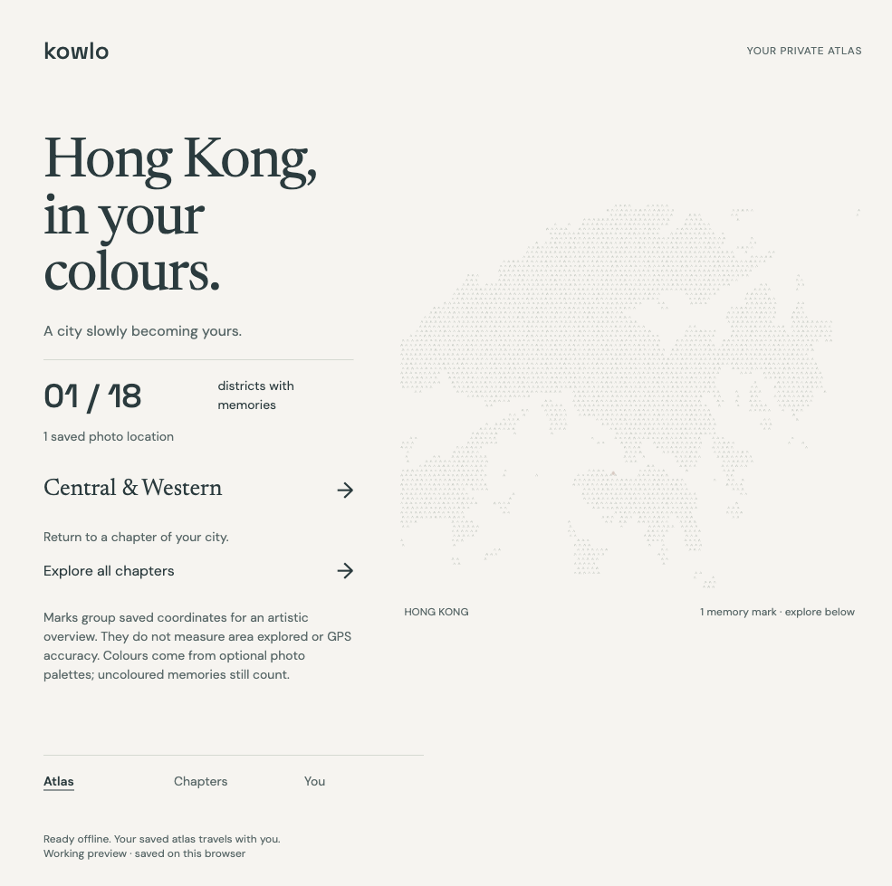

# KOWLO atlas installation

Verified 7 September 2026 with Chromium 151.0.7922.34. The working atlas can be installed locally, launched in a standalone app window and reopened with its saved journal after the preview server stops. This is scoped desktop evidence; production deployment and phone behaviour remain unfinished.

## Implementation

`app/manifest.webmanifest` supplies a stable `/app/` identity, an atlas start route, standalone display, paper theme and 192/512 px PNG icons. The page also supplies a 180 px Apple touch icon. The icon renderer reuses the existing [Harbour K vector](../design-assets/kowlo-symbol.svg); the complete symbol fits within the maskable safe circle. Production design approval remains pending.

The preview server serves the manifest as `application/manifest+json` and permits same-origin manifests only on `/app/` through its content security policy. The atlas v2 service worker prepares 18 static resources, including the manifest and icons, with the existing atomic installation and waiting-update rules. Journal data stays in IndexedDB.

These choices follow [MDN's PWA installation requirements](https://developer.mozilla.org/en-US/docs/Web/Progressive_web_apps/Guides/Making_PWAs_installable) and [icon guidance](https://developer.mozilla.org/en-US/docs/Web/Progressive_web_apps/How_to/Define_app_icons). Installation UI depends on the browser. A deployed installation requires HTTPS; localhost is suitable for this desktop verification.

## Observed evidence

[The installation report](atlas/install-checks.json) records four passing checks:

- Chromium parsed the manifest without errors, reported no installability errors and received the correct MIME type.
- All three icons decoded at their declared dimensions. They are opaque, with the foreground inside a radius of 40% of the image width.
- An actual installation in an isolated temporary Chromium profile launched with `display-mode: standalone` and read the same synthetic local journal.
- After the app window closed and the test server terminated, a fresh standalone launch restored the coloured atlas, district count and chapter navigation. The test installation was subsequently removed.

The driver uses the documented [Chrome DevTools PWA protocol](https://chromedevtools.github.io/devtools-protocol/tot/PWA/) to install, select the standalone app-window preference, launch and uninstall. The explicit preference is necessary because DevTools installation initially opened a browser tab in this runtime. Display mode is asserted in the launched application; it is not emulated.

The initial browser page reported no JavaScript errors or CSP violations. The installation driver's error listeners cover that page; the separate [atlas regression report](atlas/chromium-checks.json) and [offline report](atlas/offline-checks.json) cover their own interaction scenarios. The Codex browser panel was also used to navigate Atlas → Chapters → Atlas and visually inspect the empty state and waiting-update message. Personal photographs were not accessed.

## Reproduction and boundaries

With Playwright and its full headed Chromium runtime installed, run `node scripts/atlas-install-checks.mjs`. Set `PLAYWRIGHT_MODULE` to the installed Playwright module path if it is not locally resolvable. The script starts a temporary localhost server, creates synthetic records in an isolated profile and removes its test installation and profile. `node scripts/render-install-icons.mjs` regenerates the PNGs from the existing vector using the same module configuration.

To explore the preview, run `npm run diagnostic` and open `http://127.0.0.1:8787/app/index.html`. Browser-native installation is available where supported. Wait for **Ready offline** before depending on disconnected access. Existing open atlas tabs may display the waiting-update message until they close; the worker does not reload unsaved edits.

Initial connected preparation is required. Local records belong to the browser profile and origin, so changing the host or port does not migrate a journal. Clearing or evicting browser storage can remove records and cached resources. Installation does not grant automatic access to the phone's photo library; that delivery decision remains in the [automatic-library amendment](../AUTOMATIC_LIBRARY_AMENDMENT.md).

Safari, iOS, Android and physical-device installation have not been verified. A phone's localhost address does not reach this desktop preview. Production hosting, hosted authentication/sync and final design approval remain unfinished. Configured editor language servers were unavailable; executable syntax and browser checks supply the scoped evidence. No deployment, cloud migration, public release or remote push was performed for this unit.
