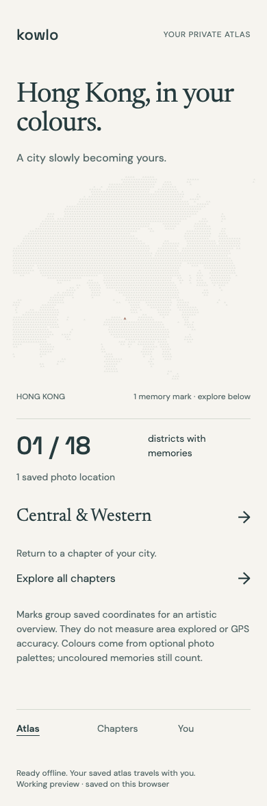

# KOWLO atlas offline verification

Verified 7 September 2026 in Chromium using isolated synthetic journal records. This extends the working `/app/` atlas; it does not establish production installation, native photo-library access or hosted sync.

## Behaviour and cache policy

After a successful connected load, the footer displays **Ready offline. Your saved atlas travels with you.** The atlas can then reopen on the same browser and origin, display saved colours and district chapters, edit notes, export JSON and confirm local deletion without the server.

`app/offline-worker.mjs` v2 prepares an explicit allowlist of 18 static application, font, installation and reference resources. Preparation failure removes the incomplete cache and prevents activation. The journal remains in its existing IndexedDB store; photographs and journal payloads are not added to the service-worker cache. Requests with queries, authorization headers, non-GET methods or paths outside the allowlist bypass that cache. Navigation fragments are removed before allowlist comparison so routes such as `#atlas` can reopen offline.

Updates wait for open atlas tabs to close. The interface asks users to save edits before closing; it does not force a reload or activate an update over an unsaved note. Activation removes only obsolete caches with the atlas prefix and preserves the diagnostic cache and journal. Any release changing an allowlisted resource must also bump the worker's cache version.

This uses the browser's documented [service-worker installation and update lifecycle](https://developer.mozilla.org/en-US/docs/Web/API/Service_Worker_API/Using_Service_Workers) and [`Cache.addAll` failure semantics](https://developer.mozilla.org/en-US/docs/Web/API/Cache/addAll). The runtime checks below establish the application's scoped behaviour.

## Observed verification

[The machine-readable report](atlas/offline-checks.json) records PASS for six scenarios:

- A required font returning 503 leaves no partial cache or false ready state; the connected journal still opens.
- An actual waiting worker preserves an unsaved note and displays the save-before-closing message.
- Closing the atlas tab permits the update to activate. The old atlas cache disappears; the separate diagnostic cache and saved journal survive.
- With the test server confirmed terminated and browser networking disabled, a full route reload restores the coloured atlas, fonts, district count and original GPS. A note edited offline survives reload.
- Cancelling deletion preserves the location. Confirming deletion removes its mark and district progress after reload. An actual JSON download retains the separately authored note with no observation link.
- The cache remains exactly the 18 allowlisted resources. Query, private endpoint, POST and authenticated requests cannot be served offline. No page errors occur.

The [atlas regression report](atlas/chromium-checks.json) also passes its seven scenarios, including reference corruption in the actual service-worker cache, navigation, notes, export, deletion and five route types at 320, 390, 768 and 1440 px widths. The existing Node suite passes 46 tests. The live Codex browser panel displayed the ready footer and was used to navigate Atlas → Chapters → Atlas.

## Reproduce

Run `npm ci` and `npm run diagnostic`, then open `http://127.0.0.1:8787/app/index.html`. Wait for **Ready offline** before stopping the server and reopening that same URL. Saved diagnostic records are available only in the same browser and origin.

With Playwright and Chromium installed, run `node scripts/atlas-offline-checks.mjs`. Set `PLAYWRIGHT_MODULE` to an installed Playwright module path if necessary. The driver starts an isolated test server, exercises preparation failure and worker replacement, terminates the server before offline checks, and writes the report and screenshot. It does not read personal photographs or modify production source to simulate an update.

## Limits

Service workers require browser support and a secure context; localhost is supported for this preview. An initial successful connected preparation is required. Browser storage eviction or clearing site data can remove cached resources and local records; this is not a permanent backup guarantee. The footer reports offline readiness rather than inferring network reachability from `navigator.onLine`.

Safari, iOS and physical-device behaviour remain unverified because the available Playwright WebKit runtime was absent. [Local Chromium installation and a standalone offline relaunch](atlas-installation.md) are now verified separately; production installation and the native photo-library flow remain unfinished. Configured editor diagnostics were unavailable; executable syntax and runtime checks supply the scoped evidence. No cloud migration, deployment, public release or remote push was performed for this unit.
