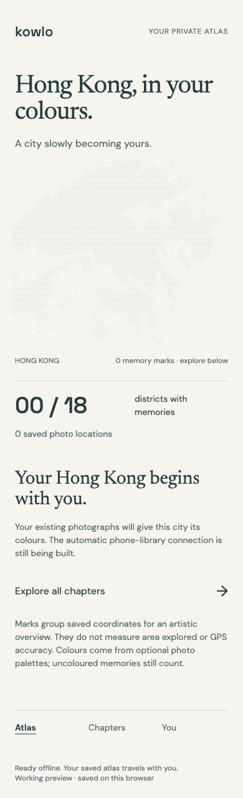
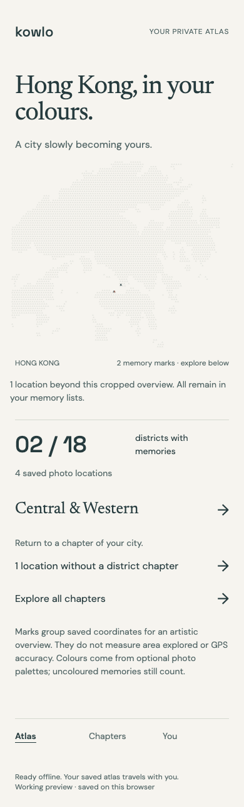
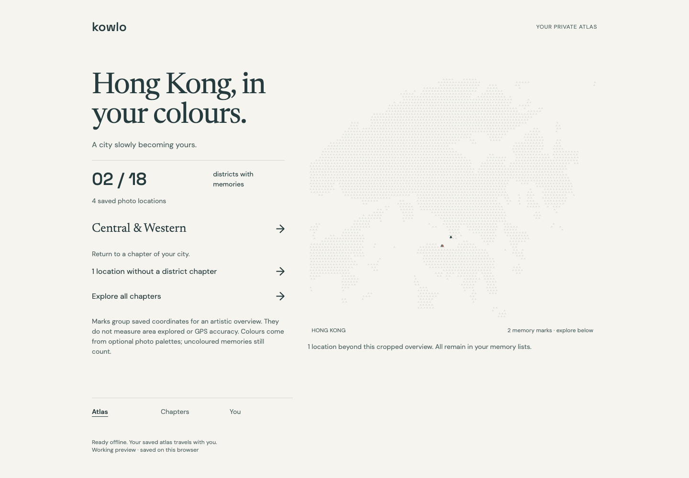
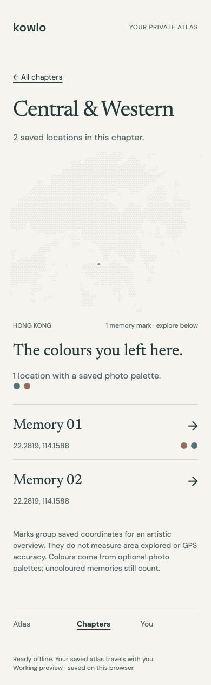
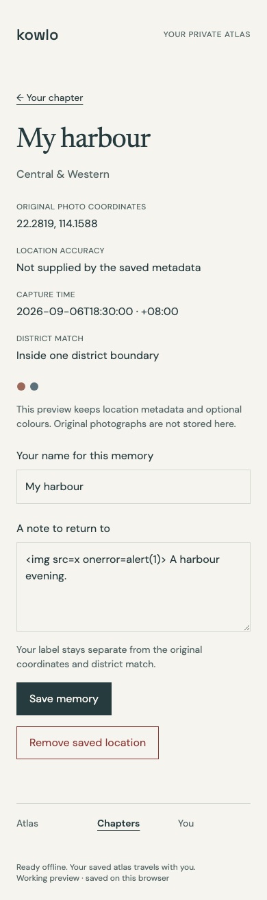

# KOWLO working atlas preview

Initially verified 6 September 2026; [atlas offline support](atlas-offline.md) verified 7 September 2026. This is a local interface integration preview, not a completed or installed production application.

## Implemented experience

The atlas connects the existing IndexedDB journal, verified district reference and deterministic memory-print pipeline to a working interface. Atlas → chapters → district → memory navigation uses saved records. Repeat observations enrich chapters without inflating the count of distinct districts. Records outside the Hong Kong artwork remain accessible through the record list.

The neutral folded-map background contains no illustrative visit colours. Saved optional photo palettes colour real memory cells; records without palettes use neutral ink. The overview is an artistic aggregation, not a claim of precise point placement or GPS accuracy. Original coordinates and capture-time evidence remain visible in each memory. Map marks are not interactive; district and memory lists provide navigation.

Personal place labels and notes persist separately from original location evidence. Unsaved note drafts survive tab visibility changes. Local deletion requires confirmation, removes the observation and recalculates colours, while retaining its authored note. JSON export downloads the current local snapshot, including retained notes.

## Design source

The interface adapts the [KOWLO Atlas identity frame, 182:202](https://www.figma.com/design/whw3t850Pcj9LrSiBa8rwn/Hong-Kong-Footprints?node-id=182-202) and the [chapter collection, 116:114](https://www.figma.com/design/whw3t850Pcj9LrSiBa8rwn/Hong-Kong-Footprints?node-id=116-114). Production design approval remains pending.

Paper `#F6F4EF`, ink `#263B3E`, restrained rules and open spacing carry the visual hierarchy. Newsreader provides editorial titles, DM Sans provides reading and controls, and Space Grotesk provides the wordmark and counts. Fonts are served locally with pinned provenance and OFL licences in `app/fonts/`. Mobile titles use 40/42 px and desktop titles 60/62 px; body copy uses 16/24 px. Colour alone does not communicate counts or geographic certainty.

## Verification

- `npm test`: 46 passing Node tests in the existing metadata and geography suite.
- JavaScript syntax checks for the application and browser driver, Python AST parsing for both changed Python scripts, and authored-source whitespace checks: PASS. The byte-preserved upstream OFL files use CRLF line endings and trigger Git's default whitespace warning; they are excluded from that whitespace check so their pinned hashes remain intact.
- [Chromium report](atlas/chromium-checks.json): PASS using isolated synthetic IndexedDB records, without accessing the personal photo library.
- Four observations produced two distinct districts and two map cells. Repeated coordinates did not inflate district totals. Outside-viewport records remained accessible.
- Browser navigation, literal HTML note handling, save/reload, draft preservation, deletion cancellation and confirmation, palette recalculation and actual JSON download were exercised.
- A district-reference hash mismatch suppressed unverified achievement counts while preserving access to every saved record.
- Five route types fit 320, 390, 768 and 1440 px widths. Keyboard skip navigation moved focus without changing the application route.
- No browser errors, external requests or non-GET requests were observed. Private repository/configuration paths returned 404 through the static server.
- The actual Codex browser panel opened the preview and displayed its honest empty-journal state.

The screenshot review found readable type, the intended restrained palette, a neutral Hong Kong silhouette and no horizontal overflow. The mobile atlas scrolls vertically. These checks do not establish universal accessibility compliance or a numerical design-quality score.

## Reproduce

Run `npm ci`, `npm test`, then `npm run diagnostic`. Open `http://127.0.0.1:8787/app/index.html` in the same browser and origin used for saved diagnostic records.

With Playwright and its Chromium runtime available, run `node scripts/atlas-browser-checks.mjs`. Set `PLAYWRIGHT_MODULE` to an installed Playwright module path when it is not locally resolvable. The driver starts its own temporary server and isolated browser context, then writes the report and screenshots above.

## Remaining boundaries

Automatic phone photo-library scanning, native permission handling, production installation, hosted authentication/sync and physical-device verification are unfinished. This preview now has separately verified [offline support](atlas-offline.md), including a server-off reload, note editing, JSON download, deletion and worker updates.

WebKit verification was attempted but could not launch because the Playwright WebKit runtime was absent. Safari and iOS behaviour therefore remain unverified. Automatic editor diagnostics were unavailable because the configured language servers were not installed; executable tests, syntax checks and browser checks supply the scoped evidence instead.

No Supabase project, deployment, public release or new remote publication was performed for this preview. The native delivery decision remains documented in [the automatic-library amendment](../AUTOMATIC_LIBRARY_AMENDMENT.md).
