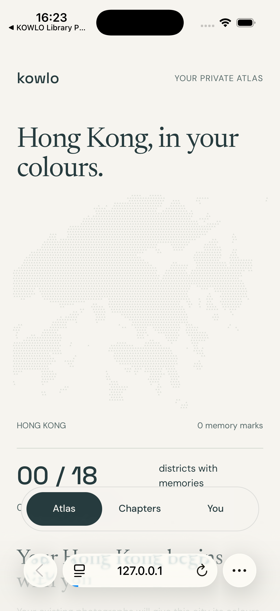

# Atlas safe-area correction

8 September 2026. The native Library probe is a developer verification harness, not the KOWLO product interface. The visible simulator preview was returned to the atlas web companion.

The iPhone Safari check exposed the masthead overlapping the status area with `viewport-fit=cover`. The document now reserves the top and horizontal system safe-area insets; the existing bottom navigation inset is preserved. The offline shell advances to v6 so previously cached styling can update. The cache-upgrade test advances from v6 to a synthetic v7.

Observed on the dedicated iPhone 17 Pro / iOS 26.5 simulator: the brand and masthead clear the system status area; the map and floating Atlas / Chapters / You navigation render. The desktop app's narrow browser panel also renders after reload. This is a layout check, not proof of native photo-library integration or completed product UX.

Verification: `scripts/atlas-offline-checks.mjs` passed all seven groups in Chromium, including cache replacement, offline reload and retained-note persistence. No page errors. `git diff --check` passed. Native permission and metadata verification remains documented in [native-ios-library.md](native-ios-library.md). Native atlas integration is outstanding. LSP services were unavailable; browser observation and the existing offline checks are the relevant verification surfaces.
